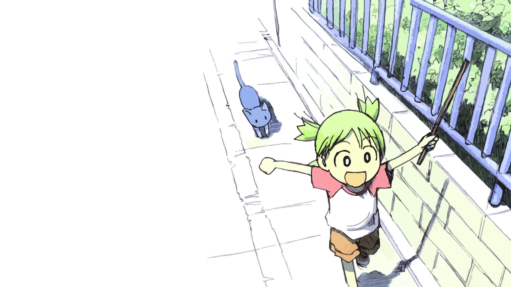

Welcome to the blog. This is where I write about software, side projects, and whatever else I find interesting.

This site is built with [Astro](https://astro.build) and deployed to [Vercel](https://vercel.com). Posts are plain Markdown files committed to the repository — no database, no CMS to maintain.

More posts coming soon.
