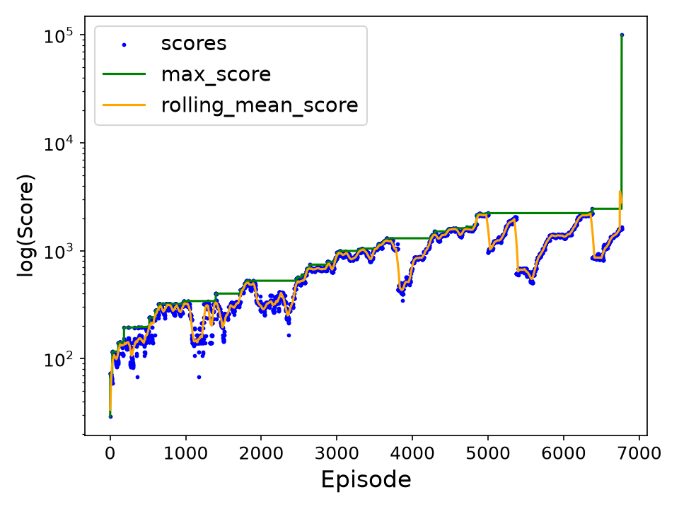

As a senior in college, the idea normally is to take it easy. Enjoy your final year in a time in which many would consider the peak of youth. However, it is within in my nature to always push myself and my endeavors as a student.

That is a lie.

Rather, I had no plan. I had no conception of what should I be doing as a senior. I am neither lazy nor gifted. What do I have however, is impulse. My friend offered to take the class with me. My reaction? "Machine learning? That sounds cool." I had just signed up for probably the most difficult class in my life up to this point. Regardless, I was going to enjoy myself. Not only did I find a lot of interest in machine learning, I also built a game from scratch. Flappy Bird, rebuilt in python for a RL agent to beat.

In terms of picking what reinforcement learning approach to take, you should consider the context. Flappy bird is a simple game. A simple premise and limited actions. This makes Q-Learning a perfect candidate. In short, Q-Learning determines the "quality" (hence the q) of a given scenario and the action it can take at that moment. In the birds case, height, distance from pipe, height of gap, and velocity are all relevant context for a decision to be made. Q-Learning saves that context and consider "did the action taken at moment lead to failure or not". 

However, there are 2 approaches as well in which I implemented. 

1. Tabular Q-Learning - basic look up table, better for smaller context

2. Deep Q-Learning - leverage a neural network for a large amount of context

For Tabular Q-Learning, I based my implementation off of Anthony Li (https://medium.com/@anthonyli358), rebuilt for my game. 

For Deep Q-Learning, I based it off of Patrick Loeber's Model for the game Snake (https://www.youtube.com/watch?v=PJl4iabBEz0) but refactored for Flappy Bird

Overall, Tabular Q-Learning was more successful given the low number of parameters at a given moment allowing for fairly quick improvements.

